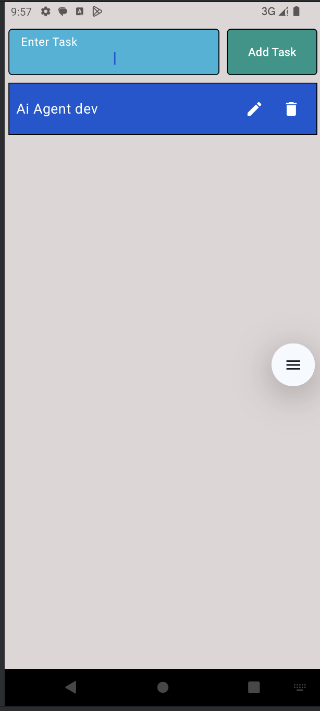
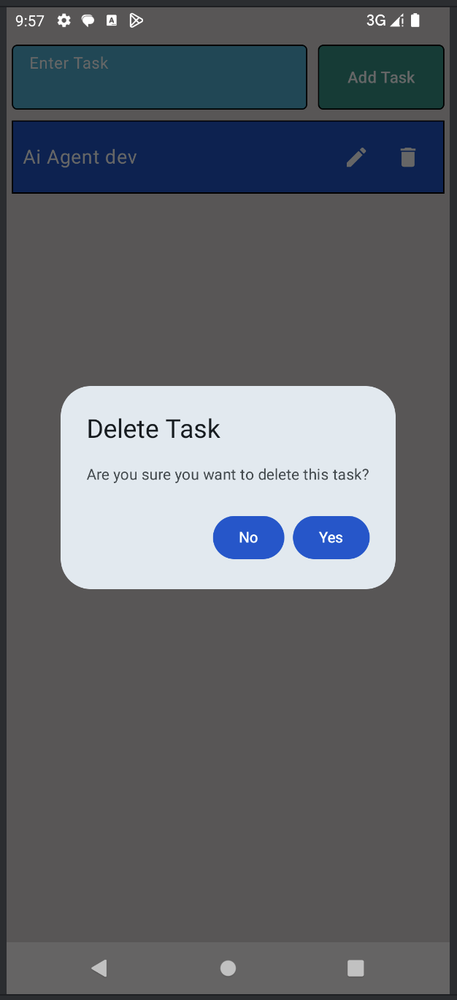

# Android Todo List App

A modern Android todo list application built with Jetpack Compose featuring a clean and intuitive user interface.

## Features

- Add new tasks with a stylish text input field
- Edit and delete tasks with material icons
- Delete confirmation dialog
- Persistent storage using internal file system
- Material Design components
- Light gray background theme

## Tech Stack

- Kotlin
- Jetpack Compose
- Material Design 3
- Internal File Storage

## Screenshots

## Implementation Details

### Storage
- Uses Android's internal storage via `FileHelper.kt`
- Stores tasks in `todo_list.txt` file
- Custom serialization for `SnapshotStateList`

### UI Components
- Material3 components including:
  - TextField with custom colors (#25B4D9, #5ABBD3)
  - Card with rounded borders
  - IconButtons with Edit/Delete actions
  - AlertDialog for delete confirmation
  - Light gray background (#FFDED6D6)
  - Green action button (#FF009688)

### Key Features
- Responsive text input with clear button
- Task cards with edit and delete options
- Confirmation dialog before deletion
- Error handling for empty task input
- Persistent storage across app restarts

## Requirements

- Android Studio Arctic Fox or later
- Minimum SDK Version: 21
- Kotlin 1.8.0 or higher

## Getting Started

1. Clone the repository
2. Open in Android Studio
3. Run on an emulator or device

